# Serveur DNS Recursif ANDY

**Auteurs :** Andy REMY
**Date de création :** 09/10/2025

---

## Administration et exploitation des services

## Activité 1 - Mise en place du serveur DNS faisant Autorité au sein de l’entreprise CUB

---

### Partie 1 : Réaliser un nouveau schéma logique

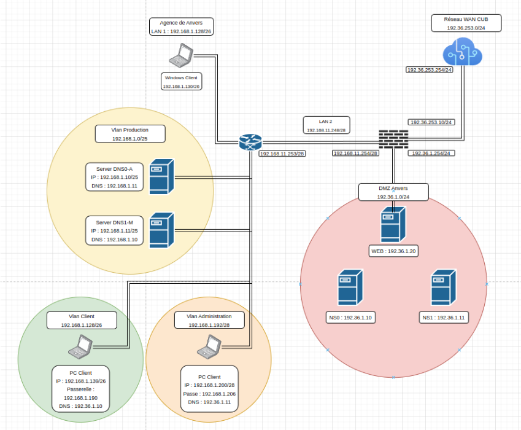

### Partie 2 : Installation et paramétrage du serveur DNS faisant Autorité

#### 1 - Vérification préalable

Mettez à jour votre serveur

- sudo apt update && sudo apt upgrade

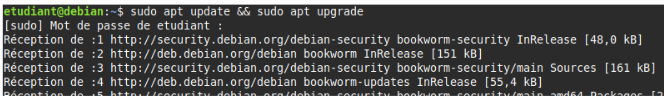

Sur votre serveur Debian 12, installez le service de journalisation rsyslog à la place de journalctl. Cela vous permettra de disposer de fichiers de log clairs au format texte situés dans /var/log.

- sudo apt install rsyslog

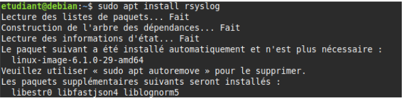

Installez le service Bind9 et les outils diagnostics DNS

- sudo apt install bind9 dnsutils

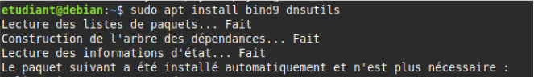

#### 2 - Définir les paramètres réseaux du serveur

- sudoedit /etc/network/interfaces

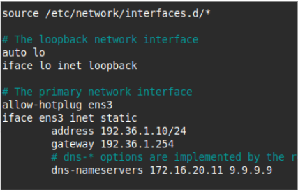

#### 3 - Définir le serveur DNS récursif à utiliser

- sudoedit /etc/resolv.conf

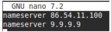

#### 4 - Prendre en compte les modifications des paramètres réseaux

- sudo systemctl restart networking

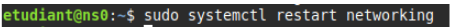

#### 5 - Configurer correctement les fichiers /etc/hostname et /etc/hosts

Le fichier **hostname** sert à donner un nom à votre serveur.

- sudoedit /etc/hostname

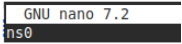

- sudoedit /etc/hosts

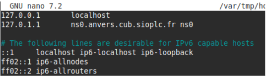

Il est nécessaire de redémarrer le serveur pour prendre en compte le changement de nom.

- sudo shutdown \-r now

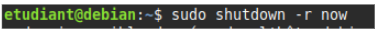

#### 6 - Exemple de configuration d'un serveur DNS maître faisant autorité

- sudo cat /etc/bind/named.conf

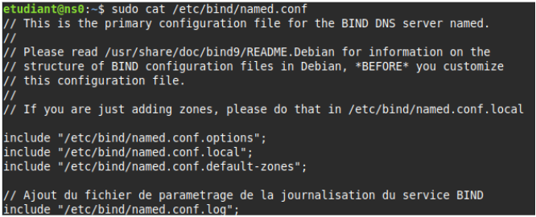

- sudo nano /etc/bind/named.conf.options

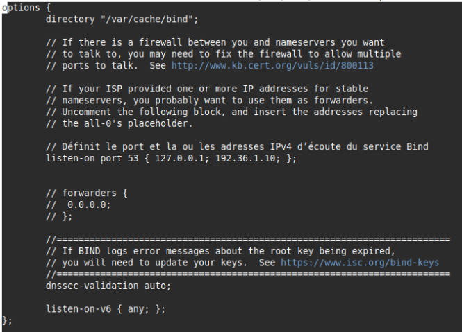

- sudoedit /etc/bind/named.conf.local

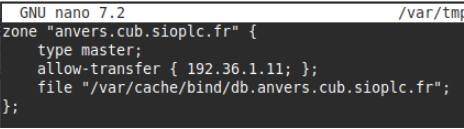

Ce fichier sert à déclarer les zones que vous aurez à gérer. Votre serveur peut-être maître sur une zone ou esclave. La directive file sert à déclarer le fichier de zone contenant les enregistrements liés (SOA, NS, A…). La directive allow-transfer permet de déclarer les serveurs esclaves habilités.

- sudoedit /var/cache/bind/db.anvers.cub.sioplc.fr

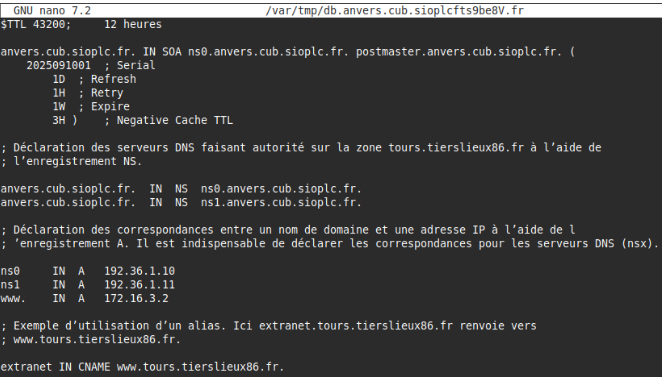

- sudo chown bind:bind /var/cache/bind/db.anvers.cub.sioplc.fr

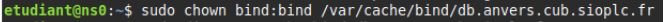

Mise en place d’une journalisation des événements du service DNS

- sudoedit /etc/bind/named.conf.log

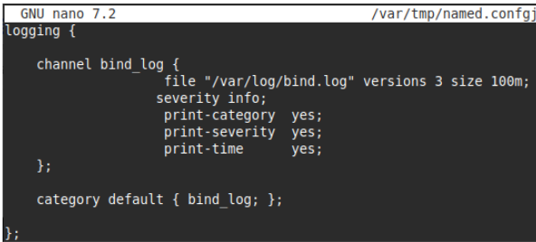

Ce fichier permet d'activer la journalisation des évènements pour le service DNS. Vous pouvez préciser le niveau de verbosité avec la directive severity mais aussi la taille maximale du fichier de log. Comme pour le fichier de zone esclave, il est nécessaire de créer un fichier vide de log avec les bonnes permissions au préalable

- sudo touch /var/log/bind.log

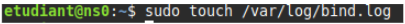

- sudo chown bind:bind /var/log/bind.log

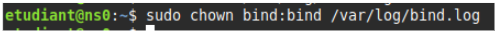

Enfin, on n’oublie pas de déclarer ce nouveau fichier de configuration dans /etc/bind/named.conf.

- sudoedit /etc/bind/named.conf

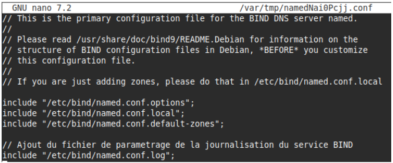

- sudoedit /etc/apparmor.d/usr.sbin.named

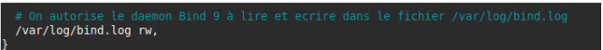

On vérifie que le nouveau fichier de configuration de AppArmor ne contient pas d’erreurs puis on redémarre le service.

- sudo apparmor\_parser \-r /etc/apparmor.d/usr.sbin.named  
- sudo systemctl restart apparmor

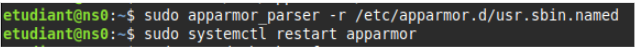

- sudo named-checkconf \-z  
- sudo systemctl restart bind9  
- sudo systemctl status bind9

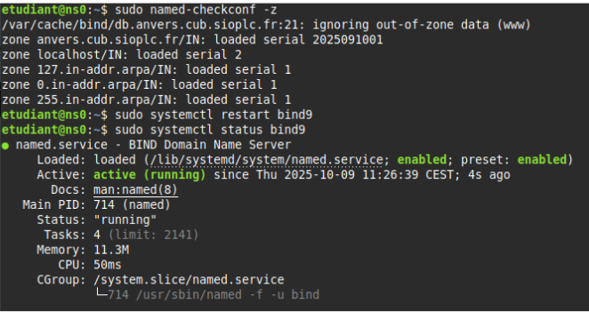

Voilà, notre serveur DNS faisant autorité maître est opérationnel \!\!

### Partie 3 : Test du serveur DNS faisant Autorité (maître)

Test de la résolution DNS

- dig 192.36.1.10 anvers.cub.sioplc.fr

![]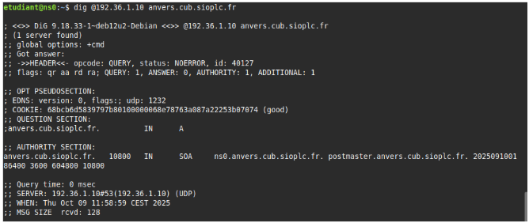

Test du Sérial SOA

- dig 192.36.1.10 [anvers.cub.sioplc.fr](http://anvers.cub.sioplc.fr) SOA \+short

Cette commande permet de voir le numéro SERIAL de votre DNS, le but est que le DNS esclave ai le même SERIAL que le maître comme ci dessous :  
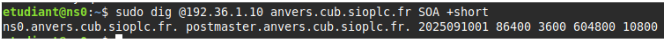

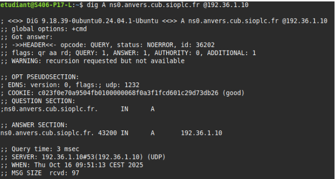

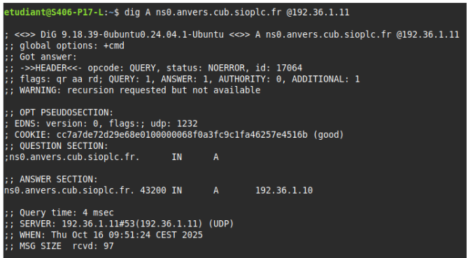

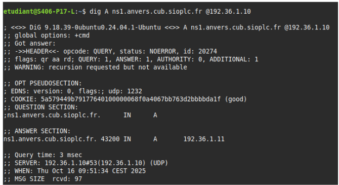

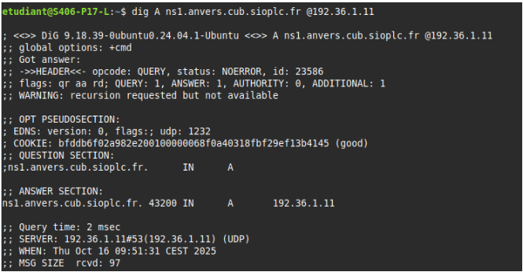

Test pour les serveur DNS Récursif :

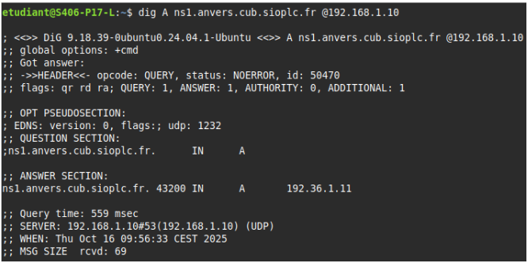

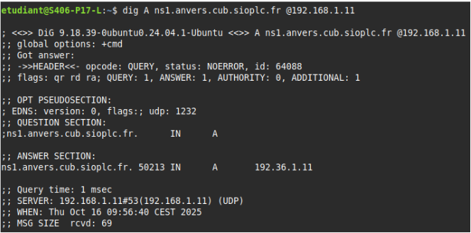

Nos serveurs DNS Maître et esclave sont maintenant opérationnels.