# Situation n°1 CUB - Connexion SSH + RDP avec l'utilisateur AdminSSH

**Auteur :** Andy REMY  
**Date de création :** 17/09/2025  

---

## Administration des systèmes

## 1 Réaliser un “sysprep” afin de réinitialiser le SID de l’OS Windows 2019

Pour commencer, réaliser un clique droit sur le logo windows, puis cliquer sur Exécuter  
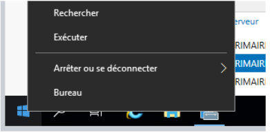

Maintenant, taper sysprep puis cliquer sur OK  
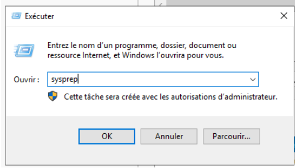

Maintenant, il suffit de lancer Sysprep puis de relancer le serveur  
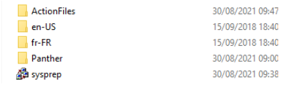

Pour savoir si le SID a bien été modifié, il suffit de réaliser cette commande dans le CMD :   
- wmic useraccount get name,sid  
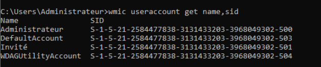

Voici le SID de mon binôme. Nous voyons bien qu’il est différent du mien  
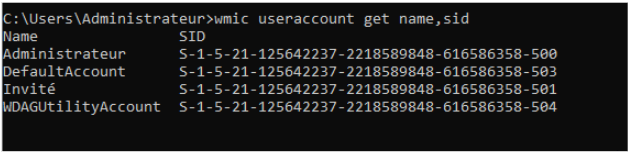

## 2 Changer le nom de votre serveur : ServeurPrimaire1

Pour commencer, il suffit de se rendre dans la rubrique Serveur local puis de liquer sur le nom de l’ordinateur en bleu  
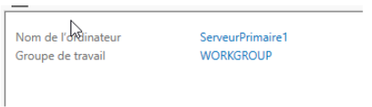

Ensuite, cliquer sur modifier pour renommer le serveur  
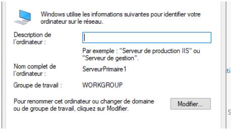 

Maintenant, il suffit de renseigner le nom du serveur de votre choix et cliquer sur OK puis redémarrer la machine  
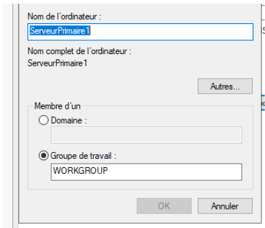

## 3 Modifier le mot de passe du compte Administrateur Local

Après que la machine ait redémarré, cela nous a demandé de modifier le mot de passe de l’administrateur Local au démarrage.   
Dans le cadre de la situation, nous avons choisi : An.Mat\_2006\!

## 4 Modifier le Vlan et l’adresse IP de votre serveur

Pour commencer, il suffit de se rendre toujours dans la rubrique Serveur local, puis cliquer sur l’adresse IP en bleu à côté de Ethernet  
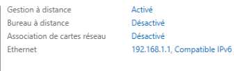

Ensuite, réaliser un clique droit sur l’Ethernet puis aller dans Propriété  
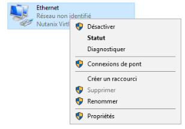

Ensuite, il suffit de cliquer sur “Protocole Internet version 4 (TCP/IPV4)  
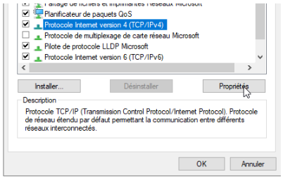

Maintenant, il suffit de renseigner l’adresse IP de son choix puis de cliquer sur “valider les paramètres en quittant” et cliquer sur OK  
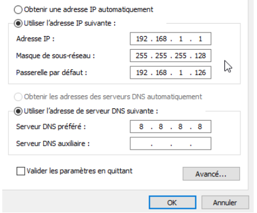

Ce qu’il faut savoir, c’est que le Vlan est déjà directement associé au projet que nous sélectionnons quand on crée la VM sous Nutanix \!

## 5 Créer un nouvel utilisateur sous Windows 2019

#### 1 : Aller dans paramètre, puis dans Comptes  
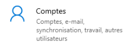

#### 2 \- Aller dans l’onglet Autres utilisateurs puis cliquer sur Ajouter un autre utilisateur sur ce PC  
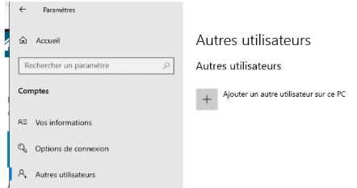 

#### 3 \- Maintenant, dans le dossier Utilisateurs, réaliser un clique droit puis Nouvel utilisateur

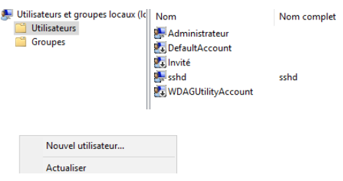 

#### 4 \- Renseigner le nom et le mot de passe de l’utilisateur  
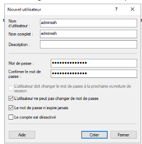

**nom** : adminssh       **mot de passe** : Cub\_Admin\_Ssh\_007  
Cliquer sur créer \!

## 6 Interdir une connexion SSH avec l’utilisateur “administrateur"

Dans le fichier de configuration, il faut commenter les deux lignes suivantes, sinon la directive DenyGroups ne fonctionne pas 
.png) 

Pour autoriser seulement mon utilisateur adminssh, j’ai ajouté dans mon document text ceci : 
 
.png)

Redémarrez le service SSH et tentez de vous connecter à votre serveur avec un compte administrateur, l'accès **doit être refusé \!**

### **Tester la connexion SSH pour l’utilisateur “adminssh”,** {#tester-la-connexion-ssh-pour-l’utilisateur-“adminssh”,}

Voici le test pour me connecter en SSH avec le nouvel utilisateur : **adminssh**
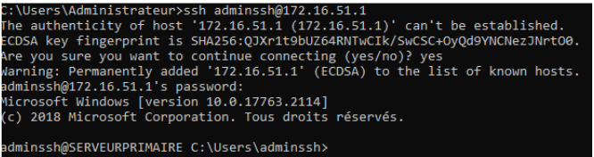

## 7 Modifier le port d’écoute par défaut ssh en 222

Ensuite, il faut décommenter la ligne "*\#Port 22*" et changer le numéro de port, comme ceci :
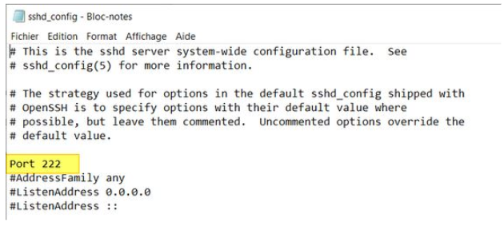

**Après chaque modification de la config, il est indispensable de redémarrer le service SSH** pour charger les nouveaux paramètres. PowerShell permet de le faire facilement :

- Restart-Service "sshd"

Voici la commande pour créer une règle de pare-feu qui autorise les connexions entrantes sur le port 222 :

- New-NetFirewallRule \-Name sshd \-DisplayName 'OpenSSH Server (sshd) \- Port 222' \-Enabled True \-Direction Inbound \-Protocol TCP \-Action Allow \-LocalPort 222

Je vous invite à en profiter pour désactiver la règle créée par défaut puisqu'elle n'est plus utile :
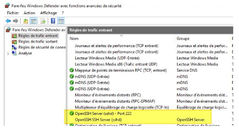

## 8 Installer l’accès à distance au serveur Windows 2019 via le protocole RDP

Sur Windows Server, l'accès "**Bureau à distance**" que l'on appelle couramment l'accès RDP s'active à partir du "**Gestionnaire de serveur**". Dans la section "**Serveur local**", il y a un paramètre nommé "Bureau à distance" qui indique l'état du service. Lorsque c'est désactivé (valeur par défaut), il n'est pas possible de se connecter en RDP sur la machine, mais cette même machine peut se connecter sur une autre machine où le Bureau à distance est actif.

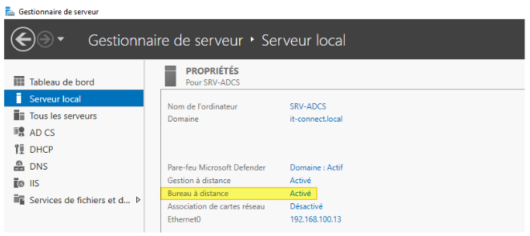

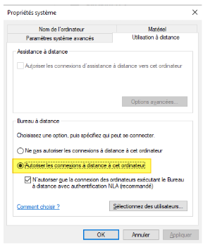

Il ne reste plus qu'à cliquer sur "OK" \! L'effet est immédiat. Si cela ne fonctionne pas, il faudra vérifier l'état du pare-feu de Windows ou de la solution de protection afin d'autoriser les connexions entrantes sur le port 3389\.

Pour cela, lancer l’application : Connexion Bureau à distance de windows

### **Tester l’accès à distance au serveur Windows 2019 via le protocole RDP** {#tester-l’accès-à-distance-au-serveur-windows-2019-via-le-protocole-rdp}
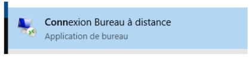

Il suffit de renseigner l’ip de notre serveur pour son nom et le nom complet de de l’utilisateur
Pour le moment, nous allons utiliser l'utilisateur **“Administrateur”**

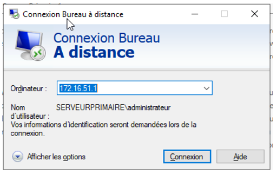

## 9 Tester la connexion RDP pour le compte “adminssh”

Afin de se connecter à distance via l’utilisateur “adminssh”, il suffit d’ajouter cet utilisateur pour avoir les droit de connexion à distance avec ce compte

Pour cela, retourner dans Sur Windows Server, Dans la section "**Serveur local”,** cliquer sur “activé” puis sur **“**S**électionner des utilisateurs”**  
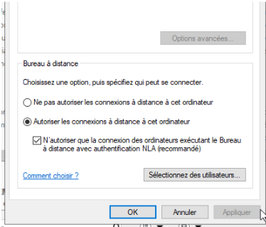

Cliquer sur **“Ajouter”**  
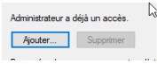

Maintenant, renseignez simplement **“adminssh”** puis cliquez sur **“Vérifier les noms”** et le nom complet s'affiche comme ci-dessous  
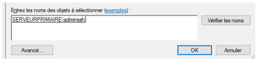

Maintenant, on peut voir apparaître le nom de l’utilisateur ajouté  
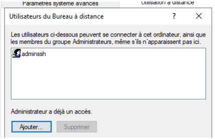

Maintenant, nous pouvons tester la connexion de bureau à distance avec l’utilisateur adminssh
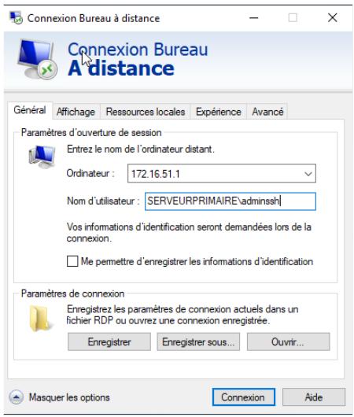
