# Situation n°2 CUB - Git

**Auteur :** Andy REMY  
**Date de création :** 17/09/2025  

---

## Administration des systèmes

# **Partie 1 : Installation de l’environnement GIT** 

### Question 2

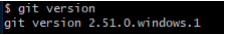  

Nous voyons donc la version de git (2.51.0.windows.1)

# **Partie 2 : Initialisation de l’environnement GIT** 

### Question 5 

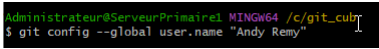  

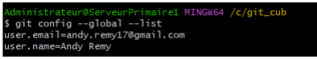  

Nous venons de créer notre identité 

### Question 6 

.png)  

Nous avons créé un dossier “premierdepot”, nous sommes rentrés dedans puis nous avons initialisé ce dépôt.

# **Partie 3 : Gérer les versions (commits) en local** 

### Question 7 

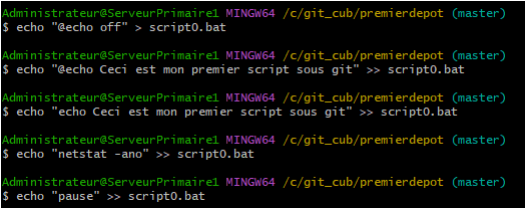  

Nous venons de créer le premier script en .bat dans le dossier “premierdepot”  
### Question 8 et 9 

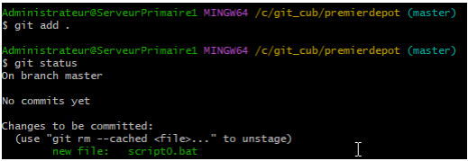

On a d’abord valider la première version du script, puis vérifier son status

### Question 10 et 11 et 12 

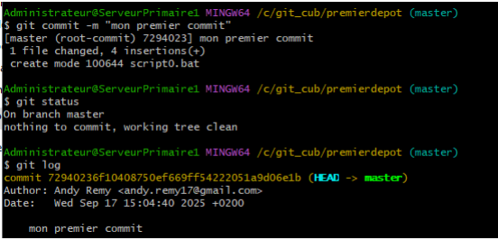 

On a réalisé la 1er version (commit), vérifier le status puis lister les versions de notre dépôt

### Question 13  

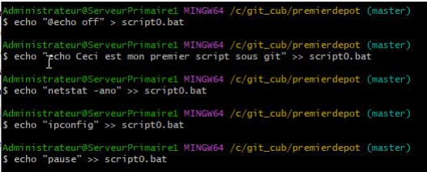 

Nous avons réalisés la deuxième de notre script et enregistrer les modifications

### Question 14  

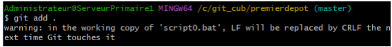  

Nous venons de valider la deuxième version du script

### Question 15  

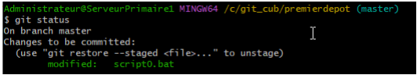 

Nous avons vérifier le status de notre dépot

### Question 16 et 17 et 18  

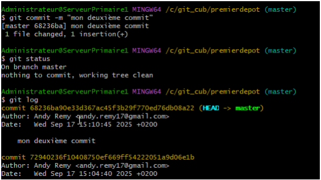 

Nous avons réalisés la deuxième version (commit) de notre dépôt, puis vérifier le status à nouveau du dépôt et lister les versions (commits) du dépôt.

### Question 19  

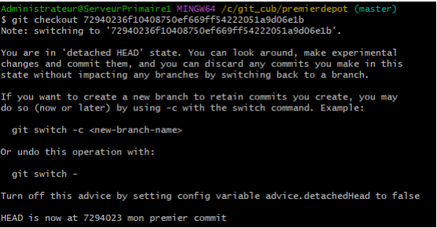  

Nous sommes revenu à la version précédente du script donc la 1er.

### Question 21 

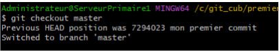 

Nous sommes revenu à la dernière version du script donc la 2ème

### Question 22  

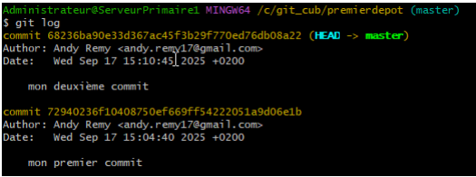

Nous avons listé les versions (commits) de notre dépôt  
**Partie 4 : Gérer les dépôts sur GitHub à distance**

Tout d’abord, nous avons créé un dépôt “premierdepotgithub”  directement sur nôtre compte GitHub.

### Question 24 

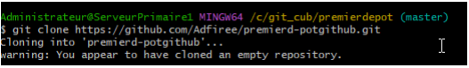 

Nous avons ensuite clonés le .bat dans ce nouveau fichier créer en local

### Question 25 

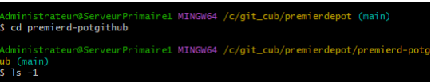 

Nous avons vérifié le contenu du “premierdepotgithub”

### Question 26  

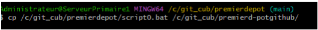 

Nous avons copiés le script0.bat vers le nouveau dossiers “premierdepotguthub”

### Question 27  

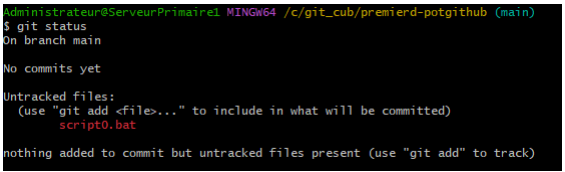 

Nous avons vérifier le status du nouveau dépôt  

### Question 28  

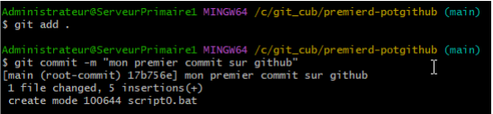

Nous avons réalisé la première version (commit) de notre dépôt.

### Question 29  

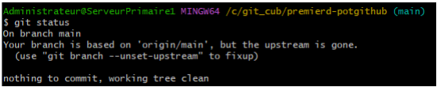 

Nous avons vérifier le status du dépôt

### Question 30  

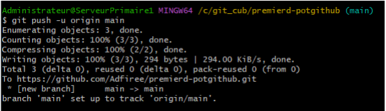 

Nous avons poussé et validé le contenu de notre dépôt local vers le dépôt distant

### Question 31  

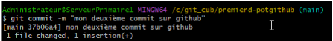

Nous avons réalisé la deuxième version (commit) de notre dépôt.

### Question 32  

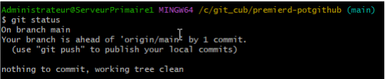 

Nous avons vérifié à nouveau le statut

### Question 33  

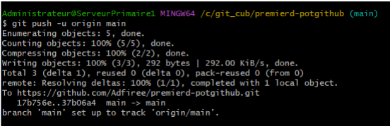

Pour finir, nous avons validé et poussé  le contenu de notre dépôt local vers le dépôt distant.