# Situation n°3 CUB - Introduction Powershell

**Auteur :** Andy REMY  
**Date de création :** 1/10/2025  

---

## Administration des systèmes

## **Introduction au Powershell**

### Question 1  

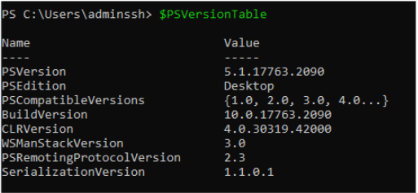

Nous voyons bien la version de notre powershell

### Question 2  

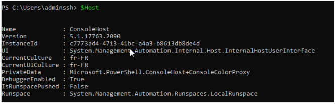

En réalisant la commande $Host, nous voyons bien que Powershell est bien éxécuté

### Question 3   

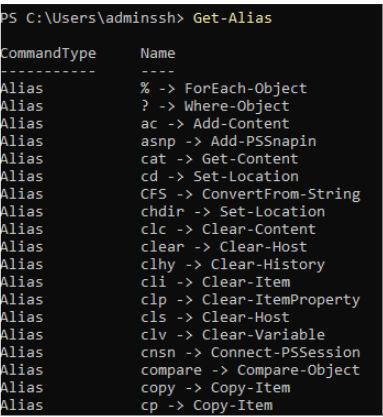

Nous pouvons voir un aperçus des Alias de Powershell grâce à la commande \-Get-Alias

### Question 4   

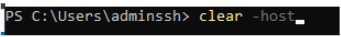 

Après cette commande, nous pouvons voir que l’écran de terminal s’efface.

### Question 5   

Après avoir réalisé la commande : Get-command, nous voyons la liste des commandes utilisables sur Powershell mais notamment les catégorie  

 

Les 3 types de commande sont donc : 

- Cmdlet  
- Function  
- Alias

### Question 6   

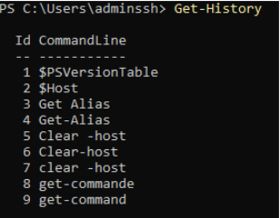 

Cette commande permet de voir l’historique des commandes que nous avons déjà réalisées.

### Question 7 

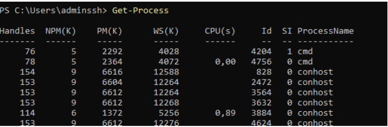

Cette information peut être utilisée en administration système afin d’administrer les services ou les processus actifs d’un serveur.

### Question 8   

Nous avons 2 commandes pour afficher page par page la liste des commandes disponibles dans Powershell : 

- Get-command | more  
- Get-command | Out-Host \-Paging

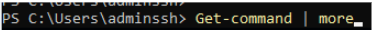 

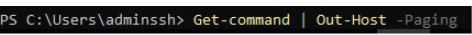

### Question 9   

Pour lister : Get-Service  
Pour démarrer : Sart-Service \<nom\>  
Pour arrêter : Stop-Service \<nom\>

### Question 10 

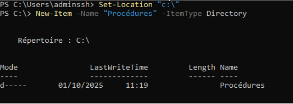 

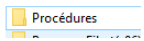 

Je me suis placé dans la racine du C puis j’ai ensuite créé le dossier “procédures”

### Question 11  

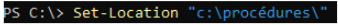 

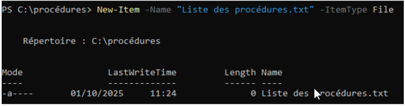  

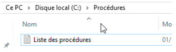 

Je me suis placé dans le dossier “procédures” puis j’ai ensuite créé le fichier “Liste des procédures.txt”

### Question 12   

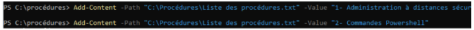 

Une fois les commandes réalisées, nous voyons bien que dans notre fichier txt, nous avons les 2 lignes ajoutées  

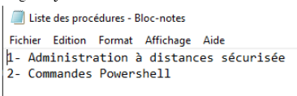

### Question 13 

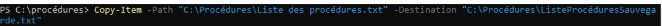 

Nous pouvons voir que nous avions bien copié le fichier txt et son contenu vers un autre fichier txt nommé “ListeProcéduresSauvegarde.txt  

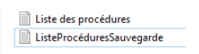  

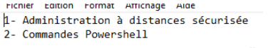