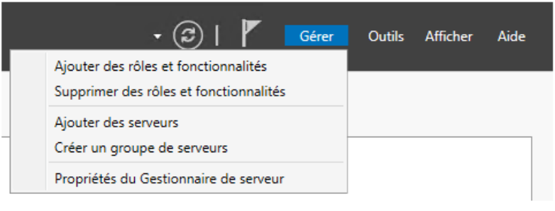
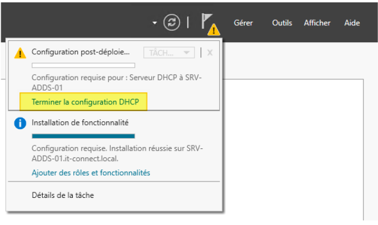
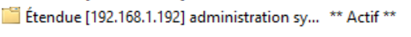
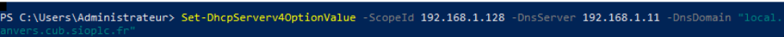

# Situation n°4 CUB - Paramétrage et sécurisation du service DHCP

**Auteur :** Matéo Beaugendre 
**Date de création :** 13/12/2025  

---

1. ### Modifier votre maquettes afin de prendre en compte l’activation du service DHCP 

Pour mettre en place le DHCP sur la maquette il suffit d’activer le service "Créer les pools" pour chaque vlan puis sur le switch de niveau 3 il faut saisir sur les vlan 10 et 20 le IP helper puis l’adresse du serveur DHCP.   
Et le résultat est que cela fournit une ip à chaque poste suivant leur vlan assigner.

### 2. Rédiger la fiche de tests de votre maquette et faire valider celle-ci par votre enseignant. 

Pour effectuer le test de notre maquette il suffit d’aller sur le poste d’un de nos vlan puis activer le DHCP sur le poste afin de recevoir une ip de la pool.

### 3. activer et paramétrer le service DHCP sur notre serveur Primaire.

Au sein du "**Gestionnaire de serveur**", cliquez sur "**Gérer**" et "**Ajouter des rôles et fonctionnalités**".

Choisissez l'option "**Installation basée sur un rôle ou une fonctionnalité**" et poursuivez.

Poursuivez directement, car le serveur local est déjà sélectionné.

Dans la liste des rôles, cochez "**Serveur DHCP**" et au sein de la fenêtre qui s'affiche, vérifiez que l'option "**Inclure les outils de gestion**" soit cochée. Elle permet d'ajouter la console de gestion DHCP sur le serveur. Cliquez sur "**Ajouter des fonctionnalités**".

L'assistant nous rappelle qu'il faut avoir **une adresse IP statique sur le serveur DHCP** avant de procéder à l'installation de ce rôle. Si c'est bien le cas, cliquez sur "**Suivant**", sinon configurez votre interface réseau.

Voici la dernière étape de l'assistant, cliquez sur "**Installer**". Il ne sera pas nécessaire de redémarrer le serveur à la fin de l'installation.

Lorsque l'installation est terminée, passez à l'étape suivante.

### 4. Autoriser le serveur DHCP dans l'Active Directory 

Dans le "**Gestionnaire de serveur**", il y a un avertissement en haut à droite. Cliquez sur l'icône puis sur "**Terminer la configuration DHCP**".

### 5. création de l’étendu DHCP avec le documents 1 {#création-de-l’étendu-dhcp-avec-le-documents-1}

l’etendu DHCP pour la pools administration a était réaliser via l’interface graphique

Pour l’étendu Via l’interface powershell pour la pools clients il faudra effectuer la commande

cela a donc créé l'étendue en disant la première adresse ainsi que la dernière et le masque puis lui dire de l’activer  
pour ajouter le Bails

Pour ajouter le Dns et le nom de domaine j’ai effectuer cette commande

Et pour ajouter la passerelle   

Pour la suite voir les fiche procédure réalisée 

