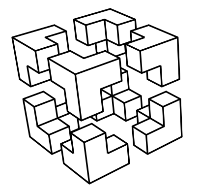

# Situation n°5 CUB - Paramétrage et sécurisation du service AD

**Auteur :** Andy REMY  
**Date de création :** 12/11/2025  

---

## Administration des systèmes

# **Paramétrage et sécurisation du service AD**

## **I - Installation des services ADDS** 

Pour commencer, nous allons ajouter la fonctionnalité “service AD DS” et procéder à son installation classique.

  

Une fois que AD DS est bien installé, vous devrez avoir cette page : 

  

## **II - Ajouter une nouvelle forêt** 

Pour commencer, nous allons cliquer sur “Promouvoir ce serveur en contrôleur de domaine”

Ensuite, nous allons ajouter la forêt que nous voulons

  

Ensuite, pour les options du contrôleur

## **III - Mot de passe pour la restauration des services d'annuaire Cub_007**

Il suffit de renseigner le mot de passe Cub_007 !

  

# **Paramétrage de l’active Directory**

## **IV - Création des unités d’organisation**

Pour commencer, nous allons créer les unités d’organisation pour chaque salle du site : 
- Salle001
- Salle002
- Salle003
- Salle004

Pour cela, il suffit de se rendre sur ordinateurs et utilisateurs Active Directory

  

Ensuite, réaliser un clique droit sur le nom de domaine puis aller dans Nouveau puis unité d’organisation

  

Ensuite, renseigner le nom donc pour notre exemple nous allons prendre “Salle001”

  

Nous pouvons donc voir que l’unité d’organisation a bien été créée ! 

  

Faire la même chose pour les autres Salles

## **V - Intégrer un ordinateur Client Windows au domaine**

Pour commencer, une fois sur la machine, aller dans les fichier et réaliser un clique droit sur Ce PC puis aller dans Propriété 

  

Ensuite, aller dans modifier les paramètre

  

Puis cliquer sur Modifier pour changer de domaine 

  

Maintenant, renseigner le nom de l’ordinateur, dans notre exemple, ce sera posteA puis le nom de domaine

  

Cliquer sur OK !

Une fois le nom de domaine modifié, vous devriez avoir cette fenêtre !

  

Pour vérifier que l’ordinateur a bien été ajouté dans l’AD, il suffit de se rendre sur l’AD puis dans Computers, nous pouvons voir apparaître le posteA

  

## **VI - Déplacer l’ordinateur PosteA dans l’unité d'organisation**

Maintenant que le computer PosteA a été ajouté dans l’AD, nous allons le déplacer dans l’unité d’organisation Salle002 que nous avons créée au préalable ! 

Pour cela, il suffit de réaliser un clique droit pour Déplacer…

  

Ensuite, il suffit de sélectionner l’unité d’organisation demandé (Salle002)

  

Nous pouvons bien voir maintenant que dans Salle002, nous retrouvons bien l’ordinateur PosteA

  

## **VII - Créer les utilisateurs**

Maintenant, nous allons créer l'utilisateur dans users.
Pour cela, il suffit de réaliser un clique droit sur ‘users’ puis nouveau et utilisateur !

  

Maintenant, il suffit de renseigner le mot de passe et le nom de l'utilisateur souhaité
Penser à bien cocher la modification du mot de passe à la première connexion 

  

  

Réaliser la même chose pour les autres utilisateurs ! 

## **VIII - Créer les groupes dans users**

Maintenant que les utilisateurs ont bien été créés, nous allons passer à la création de Groupe.
Pour cela, il suffit de réaliser un clique droit sur ‘users’ puis Nouveau et Groupe.
Renseigner ensuite l’étendue en Global, le type en Sécurité.
Il faut créer 3 groupes : 
- Production
- Clients
- Administration

Voici comment cela se présente : 

  

Faite maintenant la même chose pour les Groupes suivants !

## **IX - Ajouter les membres aux groupes créées**

Maintenant que les groupes ont bien été créés, nous allons ajouter les utilisateurs créés également auparavant dans les groupes correspondant.
Nous aurons donc David Balny et Quentin Demouliere dans le groupe Production, Ferreira dans Administration et Caramigeas dans Clients.

Pour cela, il suffit de se rendre dans ‘users’ puis dans le groupe souhaité et ajouter simplement les utilisateurs que nous voulons.

  

Pour simplifier la recherche, vous pouvez écrire le début du nom de l’utilisateur puis cliquer sur Vérifier les noms et cela affichera directement l'utilisateur souhaité !

Puis cliquer sur OK et appliquer. 
Faites la même chose pour les autres utilisateurs dans les autres groupes !

# Commandes Powershell pour l’Active Directory

## **X - Réalisée en ligne de commande l’unité d’organisation Salle005**

Dans un premier temps, avant de réaliser les commandes demandées, nous allons vérifier que l’AD a bien été chargé dans Powershell !

Voici la commande réalisé ci-dessous : 

  

Maintenant, nous pouvons réaliser les commandes demandées.

## **1 - Création d’une unité d’organisation**

Pour commencer, nous allons créer l’unité d’organisation (Salle005)

Voici la commande réalisé ci-dessous : 

  

## **2 - Déplacer l’ordinateur PosteA de la Salle002 à Salle001**

Maintenant que l’unité d'organisation créé, nous allons maintenant déplacer l’ordinateur PosteA de l’unité d’organisation Salle002 à Salle001

Voici la commande réalisé ci-dessous : 

  

## 3 - Création d’un nouvel utilisateur

Maintenant que nous savons créer une unité d’organisation et déplacer un objet d’une unité à une autre, sous allons maintenant créer un nouvel utilisateur 

identifiant : patricia delouche
mot de passe : Provisoire_007

Voici la commande réalisé ci-dessous : 

  

## 4 - Création d’une nouveau Groupe

Maintenant, nous allons créer le groupe “Développeur” dans le conteneur “Users”.

Pour cela, voici la commande réalisé ci-dessous :

  

## 5 - Ajout de l'utilisateur “Delouche” dans le groupe “Développeur”

Maintenant que nous avons créé l’utilisateur et aussi le groupe, nous allons alors déplacer l'utilisateur dans le groupe correspondant ! 

Pour cela, voici la commande réalisé ci-dessous :

  

Nous voyons bien que l’utilisateur patricia.deluche a été ajouté au groupe Développeur.

  

## 6 - Lister tous les comptes de l’AD avec le détail

Voici la commande que j’ai réalisée pour lister tous les comptes de l’AD avec le détail des informations ! 

Nous pouvons voir que nous avons tout le détail des comptes etc…

  