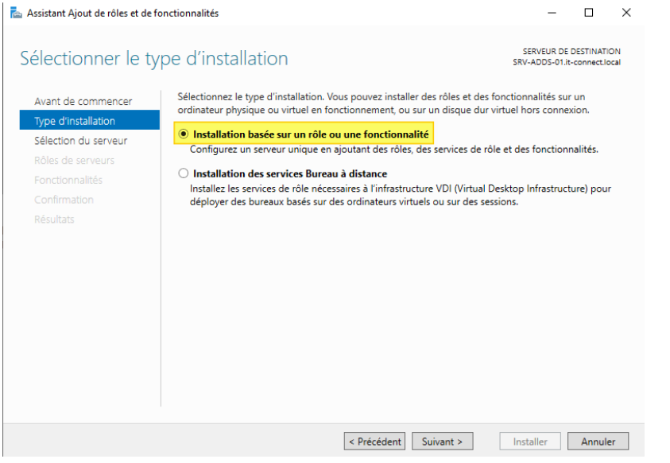
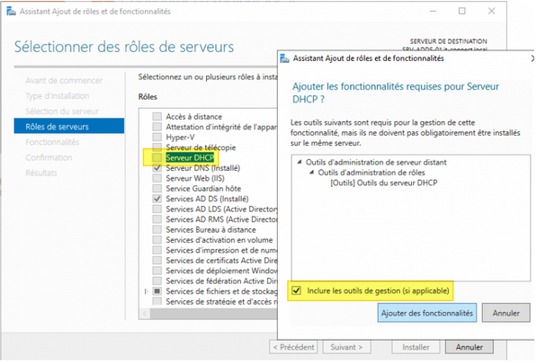
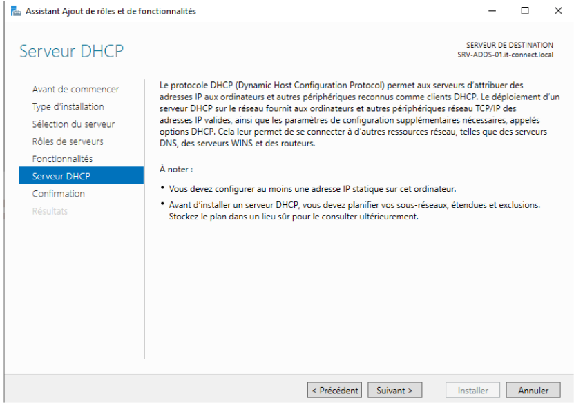
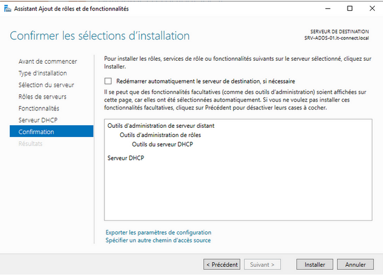

# Situation n°6 CUB - Stratégie de groupe GPO

**Auteur :** Andy REMY  
**Date de création :** 03/12/2025  

---

## Administration des systèmes

# **Stratégie de groupe GPO**

### Question 1 

L’authentification par simple login et mot de passe est problématique pour un compte administrateur du domaine parce qu’un mot de passe peut être volé, deviné ou réutilisé, ce qui rend la compromission très facile. Comme ce type de compte donne un accès total à l’ensemble du système, une seule fuite suffit à compromettre tout le domaine. 

### Question 2

Une authentification multifacteur forte exige au moins deux preuves différentes (mot de passe, objet physique, biométrie) pour vérifier l’identité, ce qui rend l’accès beaucoup plus difficile à compromettre qu’avec un seul facteur.

### Question 3

Le code PIN sert à déverrouiller et utiliser la carte SIM ou un dispositif sécurisé. 
Le code PUK sert à débloquer la carte SIM quand le PIN a été saisi de manière incorrecte trop de fois.

### Question 4

Il est obligatoire de modifier le code PIN et le code PUK avant de mettre en œuvre une nouvelle authentification parce que leurs valeurs par défaut sont connues ou facilement devinables. Tant qu’ils ne sont pas changés, n’importe qui pourrait accéder au support (carte SIM, token, clé) ou le débloquer, ce qui annulerait complètement la sécurité du nouveau dispositif d’authentification. 

### Question 5

TOTP utilise un secret symétrique qui peut être copié ou volé ; les codes peuvent être interceptés ou phishés.
Le certificat X.509 sur clé : la clé privée est protégée matériellement, ne peut pas être extraite et offre une authentification cryptographique non duplicable.
Pour conclure, TOTP est moins robuste car duplicable et vulnérable au phishing, tandis que l’authentification par certificat sur clé matérielle assure une sécurité nettement plus forte.

# Mise en place de la solution technique** 

## A - Paramétrage de l’AD

Pour commencer, nous allons créer l’arborescence.
Pour cela, nous allons créer les unités d’organisation nécessaires.

  

  

Voici les unités d’organisations créées ! 

Maintenant nous allons passer à la création des utilisateurs

  

  

Faites la même chose pour les autres utilisateurs !

### Question 6

Le RSSI nous a conseillé de créer 4 comptes distincts pour le même collaborateur David Balny pour lui permettre d’isoler les privilèges, limiter l’exposition et surtout renforcer la sécurité.

### Question 7

Un poste d’administration permet de gérer et organiser des tâches administratives.
Il est placé dans cette unité d’organisation car il a pas les même privilèges et cela permet donc de le séparer des autres unités d'organisations afin de gérer ses droits séparément

## B - Mise en place d’une autorité de certification interne PKI

Pour commencer, nous allons installer la fonctionnalité “Service de certificat AD”
Il suffit de se rendre dans Gérer, puis ajouter des rôles et fonctionnalités et sélectionner le service de certificat AD

  

Voici l’installation terminée ! 

  

Maintenant, continuez la configuration ! 
Suivez les étapes ci-dessous : 

 

  

  

  

  

Nous venons de créer l’autorité de certification interne PKI

### Question 8

La fonction d’une PKI est de sécuriser les échanges numériques en gérant les certificats et les clés pour authentifier, chiffrer et garantir l’intégrité des données.

### Question 9

Une PKI interne offre une gestion centralisée, fiable et sécurisée des certificats pour toute l’organisation, contrairement aux certificats auto-signés qui ne sont pas reconnus automatiquement et sont difficiles à gérer à grande échelle.

# Installer et configurer la PKI interne

### Question 10

Aujourd’hui, il est généralement préférable de choisir ECDSA, car il offre un meilleur niveau de sécurité à taille de clé équivalente, des performances plus rapides et une charge réduite sur les serveurs. RSA reste fiable, mais il nécessite des clés beaucoup plus longues pour atteindre le même niveau de sécurité.

### Question 11

Il est fortement recommandé de choisir SHA-256, car SHA-1 est cassé et vulnérable aux collisions déjà démontrées, tandis que SHA-256 est sécurisé, moderne et conforme aux recommandations officielles. En résumé, il faut toujours utiliser SHA-256 pour une PKI, car SHA-1 est désormais obsolète et ne doit plus être utilisé.

## C - Paramétrage de la PKI

Maintenant que nous avons créé l’autorité de certification interne PKI, nous allons maintenant la configurer et activer l’authentification par carte à puce !

Pour cela, suivez les étapes ci-dessous : 

  

  

  
  
  

  

  

## D - Mise en place des stratégies de groupe

Autorisez l’usage de certificats générés à partir d’algorithme de chiffrement :

  

  

Forcez le verrouillage de session :

Autorisez l’auto-inscription pour le compte dbalnydmt0

Forcez l’authentification SmartCard / PIV

Interdire la connexion avec le compte sanchezadmt0

# Réalisation de la recette 

### Question 12

L’authentification par certificat avec une clé de sécurité matérielle fonctionne grâce à la cryptographie asymétrique. La clé matérielle contient une clé privée stockée de façon inviolable et un certificat qui contient la clé publique. Lorsqu’un utilisateur s’authentifie, le serveur envoie un défi cryptographique. La clé matérielle signe ce défi avec la clé privée, sans jamais la révéler. Le serveur vérifie ensuite cette signature avec la clé publique contenue dans le certificat, ce qui prouve que l’utilisateur possède la clé privée et donc qu’il est légitime. Cela garantit une authentification forte, impossible à copier et protégée contre le phishing.

### Question 13

La nouvelle authentification est considérée comme multifacteur forte parce qu’elle combine plusieurs preuves d’identité indépendantes : la possession d’un élément matériel (la clé de sécurité), l’utilisation d’un certificat ou d’un secret cryptographique, et souvent un facteur lié à l’utilisateur (code PIN ou biométrie). Même si l’un des facteurs est compromis, l’accès reste impossible sans les autres, ce qui renforce très fortement la sécurité.

# Extension PowerShell

### Question 14

Importer le module de gestion des GPO :
- Import-Module GroupPolicy

Lister toutes les GPO du domaine :
- Get-GPO -All

Lister une GPO précise :
- Get-GPO -Name "NomDeLaGPO"

Créer une GPO
- New-GPO -Name "NomDeLaNouvelleGPO"

Sauvegarder une GPO
- Backup-GPO -Name "NomDeLaGPO" -Path "C:\BackupGPO"

Restaurer une GPO
- Restore-GPO -Name "NomDeLaGPO" -Path "C:\BackupGPO"

Copier une GPO
- Copy-GPO -SourceName "GPO_Source" -TargetName "GPO_Cible"

Lier une GPO à une OU
- New-GPLink -Name "NomDeLaGPO" -Target "OU=MonOU,DC=monDomaine,DC=local"

Supprimer une GPO
- Remove-GPO -Name "NomDeLaGPO"

Forcer la mise à jour des GPO sur les postes
- Invoke-GPUpdate -Computer "NomPoste"

Pour tous les postes :
- Invoke-GPUpdate -All

Obtenir les paramètres appliqués à un ordinateur
- Get-GPResultantSetOfPolicy -ReportType Html -Path "C:\RSoP.html"
